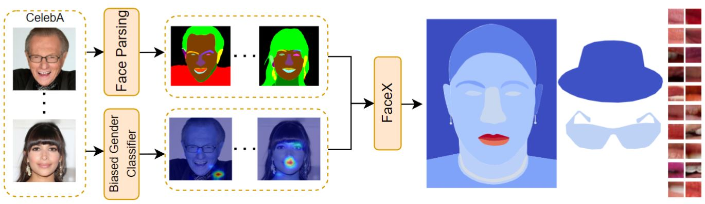
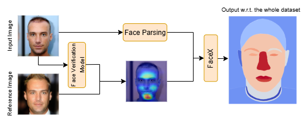

# FaceX : Understanding Face Attribute Classifiers through Summary Model Explanations
[](https://mammoth-eu.github.io/mammoth-commons/index.html)

This software is part of MAI-BIAS; a low-code toolkit for
fairness analysis and mitigation, with an accompanying suite of coding
tools. Our ecosystem operates in multidimensional and multi-attribute
settings (safeguarding multiple races, genders, etc), and across multiple
data modalities (like tabular data, images, text, graphs). Learn more
[here](https://mammoth-eu.github.io/mammoth-commons/index.html).

---
## 🌍 Overview
**FaceX** is a powerful framework for analyzing and explaining **face recognition and attribute classification models**, with a strong focus on **fairness, transparency, and real-world reliability**.

It helps you answer critical questions like:
- *Where does my model focus?*
- *What visual features drive its decisions?*
- *Is my model relying on biased shortcuts?*

Whether you're building or evaluating AI systems, FaceX provides **actionable insights into model behavior across population groups**.

---

## 🎯 Who is this for?
- **AI researchers** studying bias and explainability  
- **ML engineers** building face recognition / verification systems  
- **Industry teams** deploying biometric or identity solutions  
- **Product managers & decision-makers** ensuring trustworthy AI  

---

## 💡 Why FaceX matters
- ✅ **Reveal hidden biases** in AI models  
- ✅ **Understand model decisions visually**  
- ✅ **Prevent costly deployment failures**  
- ✅ **Build trustworthy and compliant AI systems**  

---

## 🔥 Key Features
- Explain model decisions using:
  - Heatmaps (attention visualization)
  - High-impact visual patches
- Supports both:
  - Classification models 
  - Feature-space models (e.g., face verification)
- Works with **any face dataset**
- Built on **Grad-CAM-based explanations**
- Provides **human-interpretable insights**, not just metrics

---

## 🧠 What makes it powerful
- Detects **shortcut learning** (e.g., lipstick → gender bias)
- Highlights **spurious correlations**
- Enables **fairness auditing without modifying models**
- Bridges the gap between **research and real-world deployment**

---

## 🖼️ Example: Model Explanation



FaceX employs **19 facial regions and accessories** (e.g., eyes, hair, glasses, hat) to provide detailed explanations.

- 🔵 Blue → Low importance  
- 🔴 Red → High importance  

👉 In the example above, a biased gender classifier relies heavily on the **“Wearing Lipstick”** attribute — a clear case of shortcut learning.

FaceX answers:
- **Where the model focuses** → via heatmaps  
- **What triggers predictions** → via high-impact patches  

---

<div align="center">



</div>

FaceX also supports **feature-space explanations**, where a reference image can define the target class (useful in face verification scenarios).

---

## ⚡ Quick Start
#### Install the facextool library
```
pip install facextool
```
#### Run faceX
```
import torch
from facex.component import run

# define the name of the target attribute e.g. "Gender"
target = "task"
# define the name of the protected attribute e.g. "Gender"
protected = "protected"
# load your model
model = torch.load("your_model.pt")
# define the data directory
data_dir = "<path/to/data>"
# csv should involve all these three columns: img|<task>|<protected>
csv_dir = "<path/to/annotations>.csv"
# set the model's target layer for gradcam
target_layer = "layer4"  # e.g. layer4 from resnet18
# set a specific class ("eg Male") for the target (eg "Gender").
target_class = 1

fig_heatmap, fig_patches, html = run(
    target,
    protected,
    target_class,
    model,
    data_dir,
    csv_dir,
    target_layer,
)

# Save the HTML file
with open("facex_plots.html", "w") as f:
    f.write(html)

```

## 📊 What you can do with FaceX
- Analyze bias across **demographics**
- Detect **spurious correlations** in models
- Compare model behavior across groups
- Generate **visual reports for stakeholders**
- Audit fairness in deployed systems

---

## 🌍 Real-world applications
- Identity verification systems
- Border control & surveillance  
- Hiring and screening tools  

---

## 📖 Citation
```
@inproceedings{sarridis2024facex,
  title={FaceX : Understanding Face Attribute Classifiers through Summary Model Explanations},
  author={Sarridis, Ioannis and Koutlis, Christos and Papadopoulos, Symeon and Diou, Christos},
  booktitle={Proceedings of the 2024 ACM International Conference on Multimedia Retrieval},
  year={2024}
}
```


