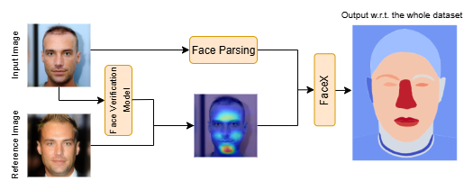

# FaceX : Understanding Face Attribute Classifiers through Summary Model Explanations

### This is the official pytorch implementation of FaceX

##### FaceX employs 19 facial regions and accessories to provide explanations (left: face regions, right: hat and glasses). Blue to red colors indicate low to high importance, respectively.  The provided illustration answers the questions "where does a model focus on?" and "what visual features trigger its focus?" through heatmap and high-impact patches visualizations, respectively. This example depicts a biased gender classifier trained on CelebA that effectively uses the Wearing_Lipstick attribute as a shortcut to predict Gender. Note that FaceX is compatible with any face dataset.

<div align="center">


</div>


##### FaceX is also applicable to models operating in the feature space. In this example, a reference image is used the target class to compute Grad-CAM activations.

### How to run
#### First install the facextool library
```
pip install facextool
```
#### Run faceX
```
import torch
from facex.component import run

# define the name of the target attribute e.g. "Gender"
target = "task"
# define the name of the protected attribute e.g. "Gender"
protected = "protected"
# load your model
model = torch.load("your_model.pt")
# define the data directory
data_dir = "<path/to/data>"
# csv should involve all these three columns: img|<task>|<protected>
csv_dir = "<path/to/annotations>.csv"
# set the model's target layer for gradcam
target_layer = "layer4"  # e.g. layer4 from resnet18
# set a specific class ("eg Male") for the target (eg "Gender").
target_class = 1

fig_heatmap, fig_patches, html = run(
    target,
    protected,
    target_class,
    model,
    data_dir,
    csv_dir,
    target_layer,
)

# Save the HTML file
with open("facex_plots.html", "w") as f:
    f.write(html)

```

### If you find this code useful in your research, please consider citing:
```
@inproceedings{sarridis2024facex,
  title={FaceX : Understanding Face Attribute Classifiers through Summary Model Explanations},
  author={Sarridis, Ioannis and Koutlis, Christos and Papadopoulos, Symeon and Diou, Christos},
  booktitle={Proceedings of the 2024 ACM International Conference on Multimedia Retrieval},
  year={2024}
}
```


